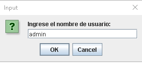

## Parcial 2 Jeicob Murillo

## Al iniciar el programa solicita el nombre y la clave para ingresar al sistema, en este caso "admin" y "1234".

## Se despliega un menú de 4 opciones, para Listar, agregar, modificar o salir.

## Al seleccionar el 1 muestra el listado de la DB y al darle "Ok" vuelve al menú principal.

## Al seleccionar el numero 2 despliega la opcion de agregar nombre del producto, luego el precio y luego la cantidad.

## Al seleccionar el numero 3 despliega un menú para seleccionar que producto se quiere editar, luego indica que si queiere cambiar los datos solo debe escribirlos, de lo contrario solo dar "Ok".

## Al seleccionar la ultima opcion (4), el programa se finaliza.

